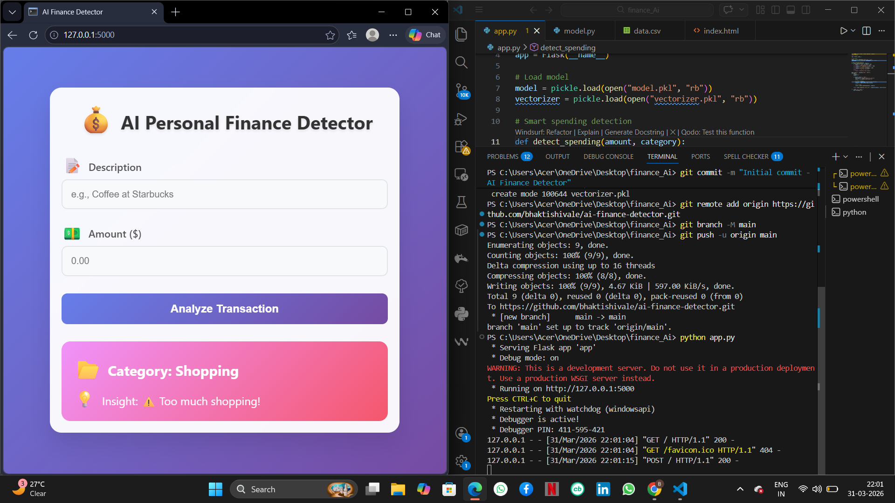

# 💰 AI Powered Personal Finance Detector

## 📌 Description
This project uses Machine Learning to classify user expenses based on text input and provide financial insights.

## 🚀 Features
- Expense category prediction using ML
- Smart spending detection
- Flask-based web app

## 🛠️ Tech Stack
- Python
- Flask
- Scikit-learn

## ▶️ How to Run
pip install pandas scikit-learn flask
python model.py
python app.py

## 📷 Screenshot
